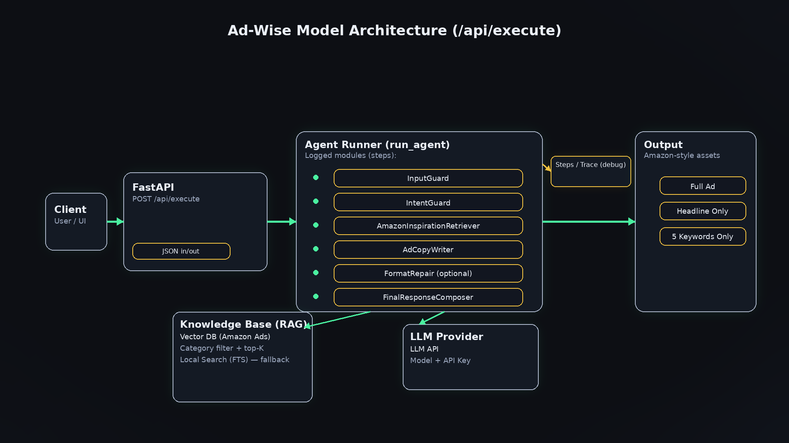

# 🧠 Ad-Wise — AI Agent for Ad Generation & Performance Evaluation

Ad-Wise is an intelligent AI agent designed to **generate high-converting ad copy** and **analyze ad performance** using structured reasoning, retrieval-augmented generation (RAG), and modular agent pipelines.

It simulates a real-world **AI evaluation + decision-making system** — combining:
- Rule-based validation
- Retrieval from real-world ad data
- LLM reasoning
- Structured output enforcement

---

## 🚀 Live Demo

👉 https://ad-wise-agent-o2ws.onrender.com

---

## ✨ What Makes This Project Special

Unlike simple LLM apps, Ad-Wise is built as a **true AI agent system**:

- 🧠 Multi-step reasoning pipeline  
- 🔍 Retrieval-Augmented Generation (RAG) from real ad data  
- 📊 Performance analysis with benchmark comparison  
- 🧾 Structured evaluation + formatting enforcement  
- 🔁 Self-repair mechanism for invalid outputs  
- 🧩 Modular architecture (each step is traceable)  

---

# 🧠 Core Idea: Agent, Not Just a Model

Ad-Wise is **not just prompting an LLM**.

It is a **decision-making agent** that:
1. Understands user intent  
2. Chooses the correct workflow (generate vs analyze)  
3. Retrieves relevant real-world examples  
4. Applies constraints and rules  
5. Produces structured outputs  
6. Validates and repairs results  

---

# 🧩 Agent Architecture



---

## 🔁 Agent Pipeline (Step-by-Step)

The agent is implemented in `run_agent()` and executes a **modular reasoning flow** :contentReference[oaicite:0]{index=0}:

### 1. 🛡 InputGuard
- Validates input (length, emptiness)
- Detects operation mode:
  - Full Ad
  - Headline Only
  - Keywords
  - Analyze Mode

---

### 2. 🧭 IntentGuard
- Determines if input is sufficient
- Requests clarification if needed
- Detects user intent (generation vs analysis)

---

### 3. 🔍 Retrieval (RAG)
- Uses vector search (Pinecone / HF embeddings)
- Retrieves real Amazon-style ad examples :contentReference[oaicite:1]{index=1}  
- Filters and ranks relevant examples

---

### 4. ✍️ AdCopyWriter (LLM Reasoning)
- Constructs structured prompts
- Injects:
  - User request
  - Retrieved examples
  - Allowed terms
- Calls LLM API :contentReference[oaicite:2]{index=2}  

---

### 5. 🔧 FormatRepair (Optional)
- If output is invalid → agent re-prompts LLM
- Ensures strict structure compliance

---

### 6. 📦 FinalResponseComposer
- Validates final output format
- Returns structured result + full trace

---

## 📊 Analyze Mode (Advanced Feature)

Ad-Wise also acts as a **performance evaluation agent**.

### Pipeline:
1. Extract metrics from text (CTR, ROI, etc.) :contentReference[oaicite:3]{index=3}  
2. Compare against benchmarks  
3. Generate:
   - Performance summary  
   - Key issues  
   - Recommendations  
   - Improved headline  

👉 This directly simulates **annotation / evaluation workflows**

---

# 🎯 Supported Modes

### 1. Full Ad Generation
- Headline
- 5 bullets
- Description
- Keywords
- Publishing tips

---

### 2. Headline Only

---

### 3. 5 Keywords Only

---

### 4. 📊 Performance Analysis
- Input: campaign metrics  
- Output: evaluation + insights + improved copy  

---

# 🧠 Conversation Agent (UX Layer)

The system includes a **stateful conversation manager** :contentReference[oaicite:4]{index=4}:

- Guides user step-by-step
- Collects structured inputs:
  - Category
  - Product
  - Constraints
- Converts UI input → structured agent prompt

---

# ⚙️ Tech Stack

- **Backend:** FastAPI :contentReference[oaicite:5]{index=5}  
- **LLM API:** OpenAI / LLMOD-compatible  
- **RAG:** Pinecone + HuggingFace embeddings  
- **Vector Search:** Semantic retrieval  
- **Frontend:** HTML + interactive UI  
- **Deployment:** Render  

---

# 🔌 API

## POST `/api/execute`

```json
{
  "prompt": "Write an ad for a stainless steel water bottle"
}
Response:
{
  "status": "ok",
  "response": "...",
  "steps": [...]
}

👉 Includes full agent reasoning trace

🧪 Example Use Cases
✍️ Ad Generation
Product: Wireless noise-cancelling headphones
Task: Full ad
📊 Performance Analysis
Analyze my ad performance:
CTR=3%, ROI=2.5, conversion_rate=5%
🧠 Why This Project Matters

This project demonstrates:

✅ AI Agents (not just prompting)
✅ Evaluation & annotation-style workflows
✅ Human-in-the-loop system design
✅ Structured reasoning pipelines
✅ Real-world product thinking
🔮 Future Improvements
Multi-agent collaboration
Reinforcement learning from feedback
Real-time ad A/B testing integration
Dashboard for performance tracking
👩‍💻 Author

Soaad Hamood
🔗 https://github.com/SoaadHamood

📄 License

MIT License


